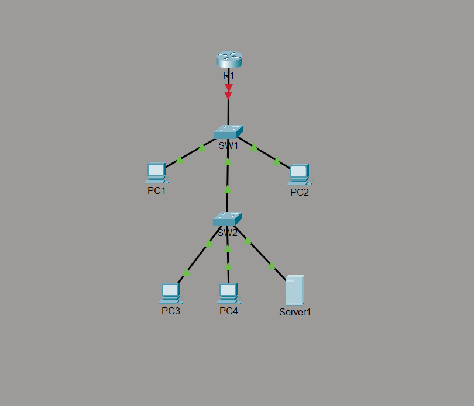
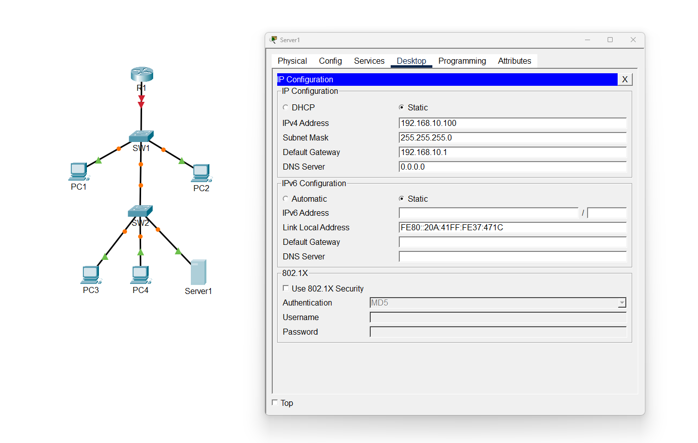
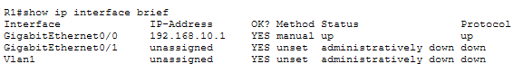
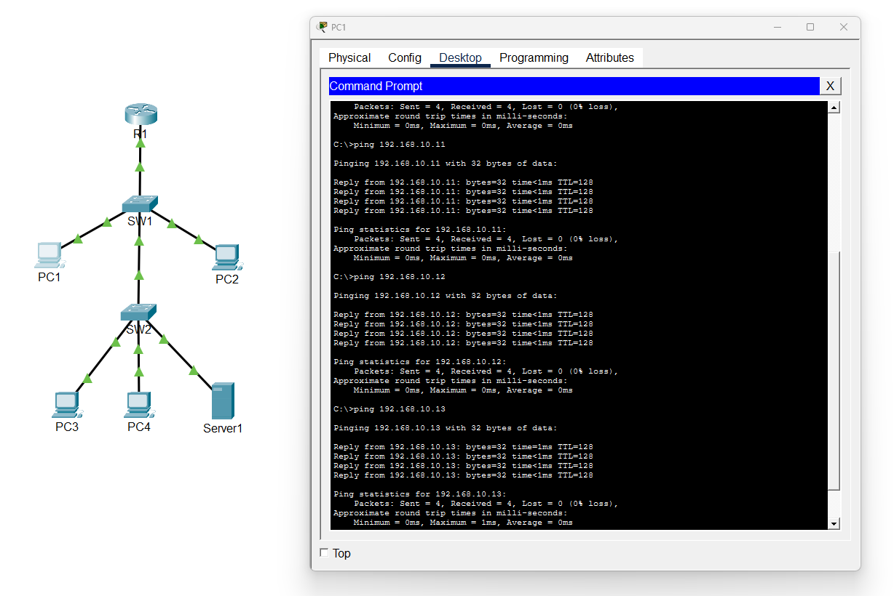
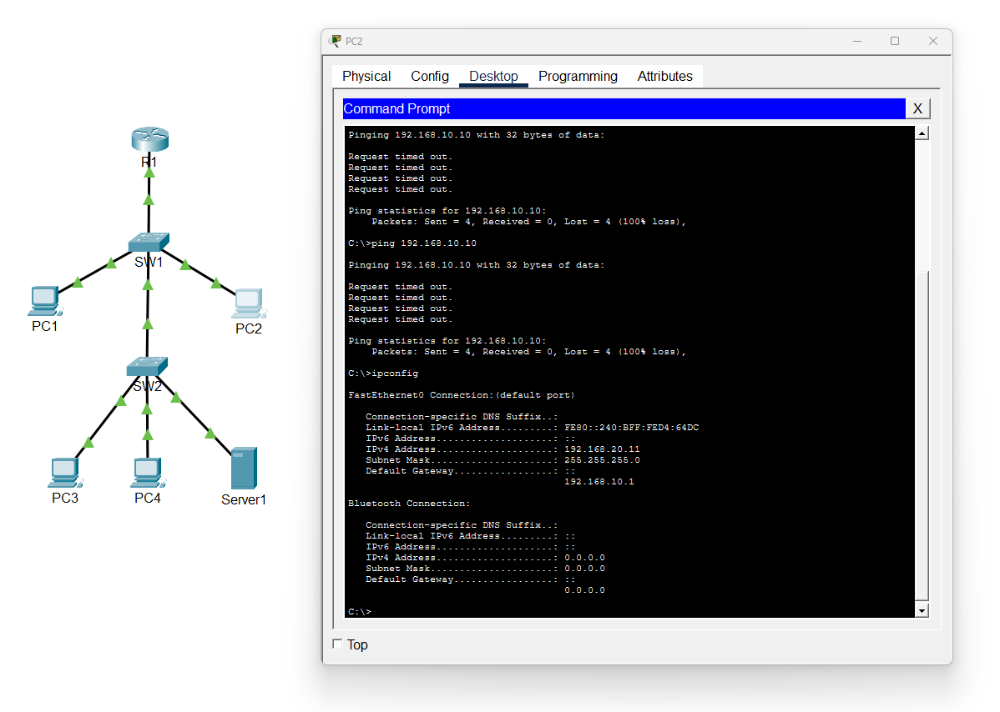

# Lab 01 - Basic LAN Connectivity

## Objective

Build and troubleshoot a basic LAN containing one Cisco router, two switches, four workstations, and one server.

This lab focuses on basic IPv4 addressing, Cisco IOS interface configuration, connectivity testing, and troubleshooting.

## Topology



The network uses the 192.168.10.0/24 subnet. All hosts connect through two Cisco switches, with R1 providing the default gateway for the LAN.

## Addressing Table

| Device | IP Address | Subnet Mask | Default Gateway |
|--------|------------|-------------|-----------------|
| R1 | 192.168.10.1 | 255.255.255.0 | N/A |
| PC1 | 192.168.10.10 | 255.255.255.0 | 192.168.10.1 |
| PC2 | 192.168.10.11 | 255.255.255.0 | 192.168.10.1 |
| PC3 | 192.168.10.12 | 255.255.255.0 | 192.168.10.1 |
| PC4 | 192.168.10.13 | 255.255.255.0 | 192.168.10.1 |
| Server1 | 192.168.10.100 | 255.255.255.0 | 192.168.10.1 |

## Host Configuration

I assigned static IPv4 addresses to each workstation and the server within the 192.168.10.0/24 network.



I configured 192.168.10.1 as the default gateway for the hosts.
## Router Configuration

I configured R1 through the Cisco IOS CLI. I assigned the GigabitEthernet0/0 interface the IP address 192.168.10.1/24 and enabled the interface using `no shutdown`.

```text
enable
configure terminal
hostname R1
interface gigabitEthernet 0/0
ip address 192.168.10.1 255.255.255.0
no shutdown
end
```

I then saved the router configuration using:

```text
copy running-config startup-config
```

## Interface Verification

After configuring the router, I used `show ip interface brief` to verify that GigabitEthernet0/0 had the correct IP address and was operational.

```text
show ip interface brief
```



The interface showed 192.168.10.1 with both the interface status and protocol in the `up` state.

## Connectivity Testing

I used the `ping` command from the PCs to test communication between the workstations, server, and router.



Successful replies confirmed that the devices on the 192.168.10.0/24 network could communicate.

## Troubleshooting Scenario

To practice troubleshooting, I intentionally changed PC2's IP address from 192.168.10.11/24 to 192.168.20.11/24.

After the change, PC2 could no longer communicate with devices on the 192.168.10.0/24 network.

I used `ipconfig` on PC2 and compared its addressing with a working computer.



I found that PC2 had been placed in the 192.168.20.0/24 subnet instead of the 192.168.10.0/24 subnet.

I corrected PC2's address back to 192.168.10.11/24 and tested connectivity again with `ping`. Communication was successfully restored.

## What I Learned

This lab helped me better understand how IP addresses, subnet masks, default gateways, switches, and router interfaces work together on a LAN.

I also learned that two devices can be physically connected to the same switch but still be unable to communicate if their Layer 3 addressing places them in different subnets.

The troubleshooting portion also gave me practice checking a host's IP configuration, comparing it with known-working devices, identifying the addressing problem, and verifying the fix.
